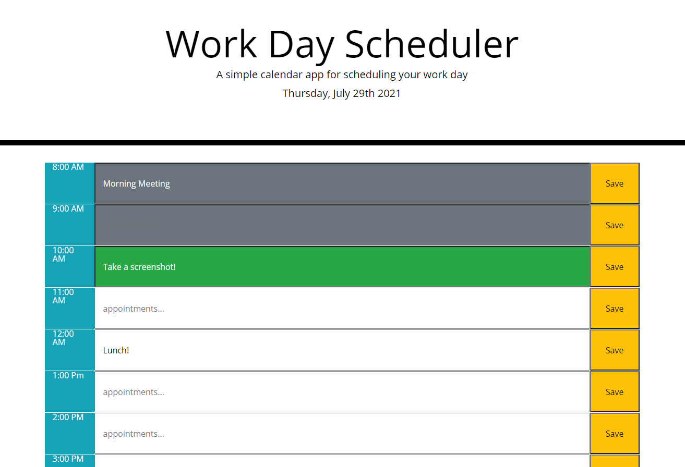

# The Day Planner Application
## Purpose
This is a simple web app written using JavaScript, JQuery and MomentJS, designed to help keep track of appointments throughout the day. Your current time is reflected in green, the future is in white and past events are grey.
Your appointments are stored in local storage for your convenience.

## Images

## Links
https://davebloisesquire.github.io/day-planner/
